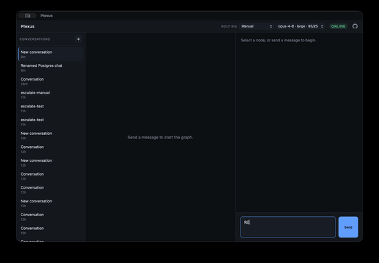

# Plexus

A desktop app where an AI conversation is a **graph of richly-rendered blocks** on a canvas — branch from any node, resume from any node, and each assistant turn renders in its *best representation* (table, link card, chart, code, interactive widget) instead of a wall of markdown.



## What's interesting

- **Adaptive blocks.** The model emits a typed array of blocks (`markdown`, `table`, `link_card`, `code`, `chart`, `choices`); the sidecar validates them, resolves link-card previews server-side, and falls back to a heuristic parser for plain prose.
- **A branching canvas.** The conversation is a tree on a [React Flow](https://reactflow.dev) canvas. Pick any node, send a message, get a new child — fork a thread and keep both directions visible with their context intact.
- **Cost-aware model routing.** Configure providers and choose a model **manually or automatically by request complexity**, optimizing for cost, quality, or a balance. A capability filter never picks a model that can't do the task; routing stays sticky per branch to preserve the prompt cache; every turn records model, cost, latency, and *why* it was picked — shown as a badge on each node.
- **Local-first & BYO key.** The graph persists to SQLite on disk; the API key lives in the OS keychain and never reaches the renderer.

## Architecture

```
┌──────────────── Tauri shell ────────────────┐
│  Frontend (Vite + React)   Sidecar (.NET)    │
│  ─ React Flow canvas        ─ conversation graph + SQLite
│  ─ block renderers          ─ model calls + prompt cache
│         ▲   local WebSocket  ─ model routing + telemetry
│         └──────────────────────────▲         │
│  OS keychain (API keys) ────────────┘         │
└───────────────────────────────────────────────┘
```

The frontend renders, never thinks. The .NET sidecar owns all state. The single most important artifact is the **Block contract** — [`contract/blocks.ts`](contract/blocks.ts), mirrored on the .NET side.

| Path        | What                                                       |
| ----------- | ---------------------------------------------------------- |
| `contract/` | `blocks.ts` — shared Block + graph + routing contract      |
| `sidecar/`  | .NET solution — the brain (WebSocket, SQLite, routing)     |
| `app/`      | Tauri shell + Vite/React frontend                          |
| `docs/`     | the guiding documents — [spec.md](docs/spec.md), [spec-model-routing.md](docs/spec-model-routing.md), [sidecar.md](docs/sidecar.md) |

## Run it

Requires the [.NET SDK](https://dotnet.microsoft.com/) (10+), [Node](https://nodejs.org) (20+), and [Rust](https://www.rust-lang.org/tools/install).

```bash
# Store your Anthropic API key in the macOS keychain (preferred) or an env var:
security add-generic-password -a plexus -s plexus-anthropic-key -w "sk-ant-..."

# Sidecar (the brain):
dotnet run --project sidecar/Plexus.Sidecar          # ws://127.0.0.1:8765

# App (in another terminal):
cd app && npm install && npm run tauri dev
```

See [docs/sidecar.md](docs/sidecar.md) for the WebSocket protocol and a spec→implementation status map.

## Status — v0.4.0

| Phase | Scope | State |
| ----- | ----- | ----- |
| **P0** | Walking skeleton: blocks, sidecar, SQLite, keychain | ✅ done (`v0.1.0`) |
| **P1** | Branching canvas, `chart`/`choices`, prompt caching | ✅ done (`v0.2.0`) |
| **R0** | Model registry (models.dev), routing seam, cost telemetry | ✅ done (`v0.3.0`) |
| **R1** | Heuristic auto-routing + unified policy control | ✅ done (`v0.4.0`) |
| **P2** | DAG merge, MCP host + `mcp_ui` block | ⏳ planned |
| **R2** | Learned router / gateway (gated on R1 telemetry) | ⏳ planned |

Next up: a one-click **"escalate to a stronger model"** action that re-runs a node as a sibling branch — model comparison as a first-class visual act.

See [docs/spec.md](docs/spec.md) and [docs/spec-model-routing.md](docs/spec-model-routing.md) for the full plans, and [docs/sidecar.md](docs/sidecar.md) for the spec→implementation map.

## Acknowledgements

**Built on** (real dependencies — see [THIRD-PARTY-NOTICES.md](THIRD-PARTY-NOTICES.md) for the full, generated list):

- [React Flow](https://reactflow.dev) (`@xyflow/react`) + [dagre](https://github.com/dagrejs/dagre) — the canvas and its layout
- [Tauri](https://tauri.app) (`@tauri-apps/*`) — the desktop shell
- [Anthropic .NET SDK](https://github.com/anthropics/anthropic-sdk-csharp) + [Microsoft.Extensions.AI](https://github.com/dotnet/extensions) — model calls
- [Microsoft.Data.Sqlite](https://github.com/dotnet/efcore) (+ SQLitePCLRaw) — local-first persistence
- [marked](https://marked.js.org) — markdown rendering
- [models.dev](https://models.dev) — live model pricing/capability metadata for the router

**Inspired by** (design influence, *not* dependencies):

- [Vercel json-render](https://github.com/vercel/json-render) & A2UI — constrained generative UI from JSON *(Plexus's block catalog is hand-rolled, not json-render)*
- [MCP-UI](https://mcpui.dev) & [MCP Apps](https://blog.modelcontextprotocol.io/posts/2025-11-21-mcp-apps/) — UI over MCP (the basis for the planned `mcp_ui` block in P2)
- [tldraw branching-chat](https://tldraw.dev/starter-kits/branching-chat) — branching conversation on a canvas
- [OpenCode](https://github.com/opencode-ai/opencode) — client/server architecture
- [RouteLLM](https://github.com/lm-sys/RouteLLM) — model routing

## License & credits

[MIT](LICENSE) © 2026 [Carlos Carminati](https://github.com/carloscarminati). Third-party licenses: [THIRD-PARTY-NOTICES.md](THIRD-PARTY-NOTICES.md).

Repository: <https://github.com/carloscarminati/plexus>
